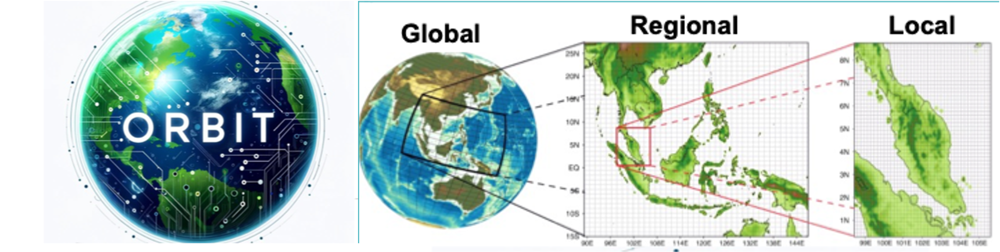

# ORBIT-2: A Foundation Model for the Earth System

  

This repository contains code accompanying the paper [**ORBIT-2: Scaling Exascale Vision Foundation Models for Weather and Climate Downscaling**](https://arxiv.org/abs/2301.10343).

## What is ORBIT-2
ORBIT-2 is a scalable foundation model for global, hyper-resolution climate downscaling. ORBIT-2 incorporates two key innovations: (1) Residual Slim ViT (Reslim), a lightweight architecture with residual learning and Bayesian regularization for efficient, robust prediction; and (2) TILES, a tile-wise sequence scaling algorithm that reduces self-attention complexity from quadratic to linear, enabling long-sequence processing and massive parallelism. ORBIT-2 scales to 10 billion parameters across 32,768 GPUs, achieving up to 1.8 ExaFLOPS sustained throughput and 92-98% strong scaling efficiency. It supports downscaling to 0.9 km global resolution and processes sequences up to 4.2 billion tokens. On 7 km resolution benchmarks, ORBIT-2 achieves high accuracy with R^2 scores in the range of 0.98 to 0.99 against observation data.

## Pretraining
The pre

## Pretraining on Frontier
To run the pretraining do `sbatch pretrain.lcf`

## Finetuning

**Installation and Run Guide**

(1) Create and activate your conda environment

(2) Do  `pip install -r requirements.txt` to install related packages in the conda environment

(3) Then do `pip install -e .` in the parent directory to install the package to the conda environment

(4) Go to examples folder. launch_intermediate.sh is the launch script to run the downscaling code for 9.5 million, 126 million, 1 billion and 10 billion parameters.
 
(5) To visualize the input, output, and ground truth, run launch_visualize.sh after training. Using only a single node with a single GPU. In visualize.py, do not forget to change the checkpoint path for the model checkpoint that you want to load.

**YAML Files for Downscaling Configurations**

Both the AI model hyperparameters and dataset configurations are configured in yaml files located in the config folder.

Available training losses include MSE, MAE, latitude weighted MSE, Pearson Score, Anomaly Coefficient. Most recently, hybrid perceptual loss, and bayesian estimation loss with total variation prior. Training losses can be changed in the yaml files.

**Available Downscaling Data** 

If you have access to Frontier supercomputer, you can access to the following downscaling datasets for training, validation and testing:
 
ERA5 5.6 degree "/lustre/orion/lrn036/world-shared/data/superres/era5/5.625_deg/"   
ERA5 1.4 degree "/lustre/orion/lrn036/world-shared/data/superres/era5/1.40625_deg/"  
ERA5 1.0 degree "/lustre/orion/lrn036/world-shared/data/superres/era5/1.0_deg/"  
ERA5 0.25 degree "/lustre/orion/lrn036/world-shared/data/superres/era5/0.25_deg/"   
PRISM 16 km "/lustre/orion/lrn036/world-shared/data/superres/prism/10.0_arcmin"  
PRISM 4 km "/lustre/orion/lrn036/world-shared/data/superres/prism/2.5_arcmin"  
DAYMET 16 km "/lustre/orion/lrn036/world-shared/data/superres/daymet/10.0_arcmin"  
DAYMET 4 km "/lustre/orion/lrn036/world-shared/data/superres/daymet/2.5_arcmin"  
DAYMET 3.5 km "/lustre/orion/lrn036/world-shared/data/superres/daymet/2.0_arcmin"  
DAYMET 800 m "/lustre/orion/lrn036/world-shared/data/superres/daymet/0.5_arcmin"   

